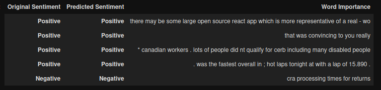
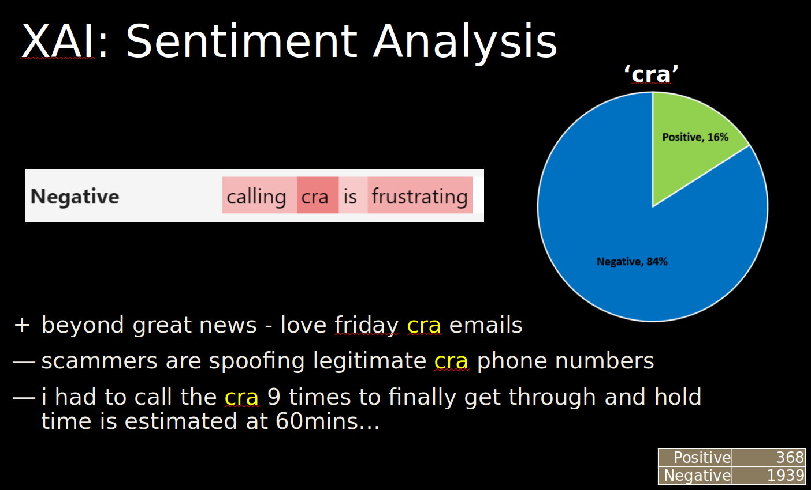
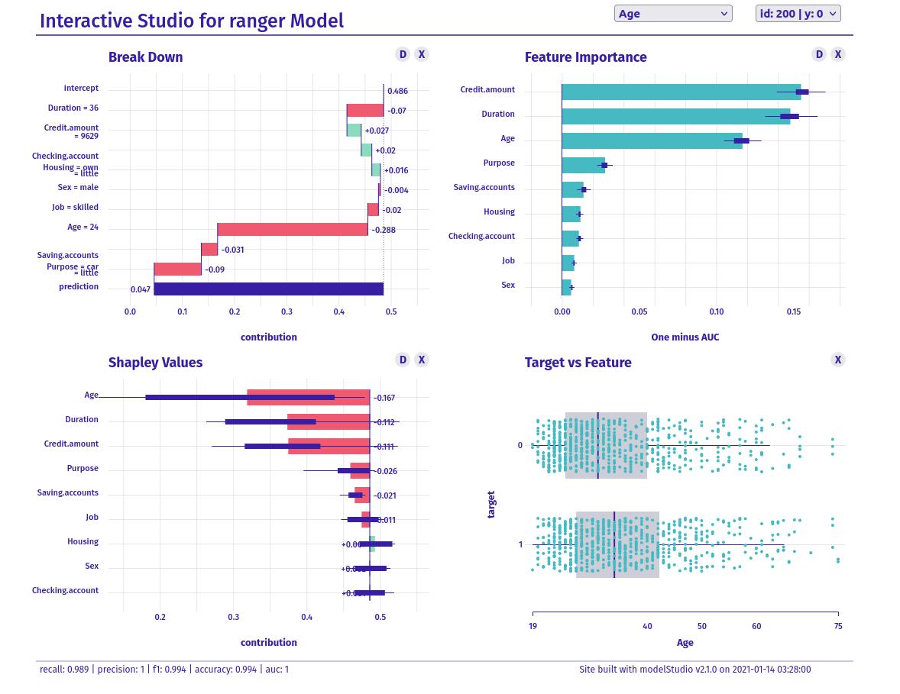
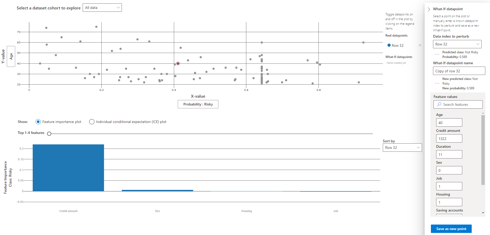

# Explainable AI: Model interpretability

## **[Deployed XAI model](https://dg1223.github.io/explainable-ai/)**

## Sentiment Analysis
Sentiment analysis and its explanation generation was done using Facebook's PyTorch-based model interpretability package called [Captum](https://captum.ai/). The dataset was collected from Canada Revenue Agency's twitter handle which sees regular taxpayer interaction.

## Explaining Credit Risk Scoring
An explanation of credit risk scoring model based on data from German Banks on 3000 borrowers

### Explaining AI using R

### Explaining AI on Azure

